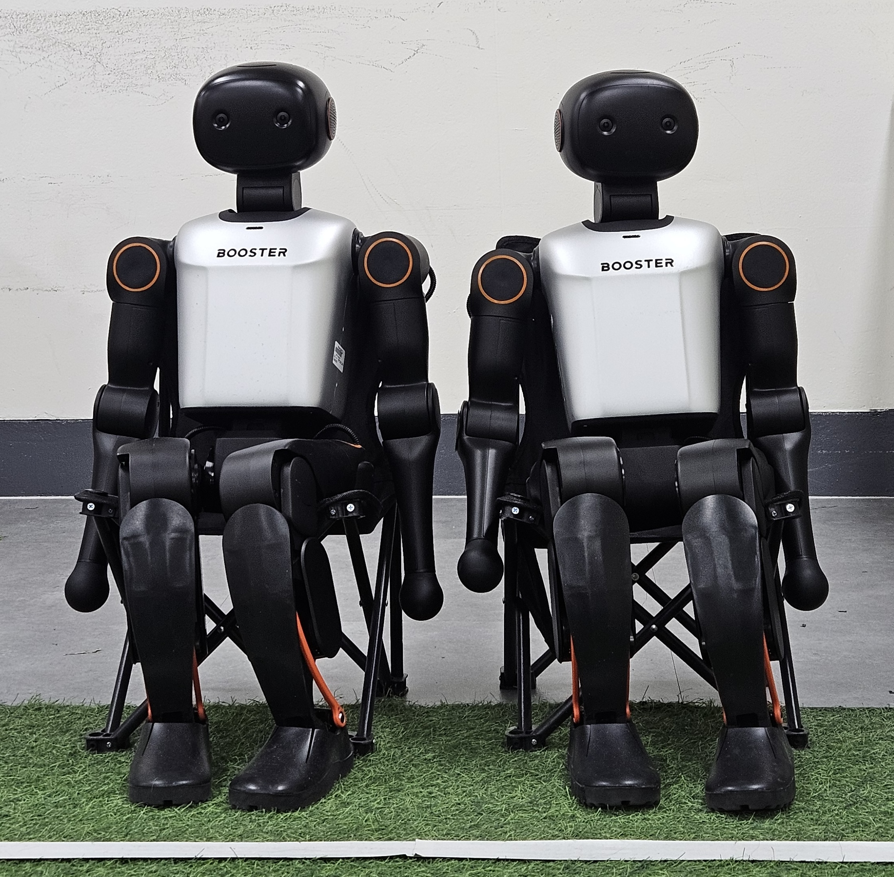

# Inha-United-Soccer

Welcome! ✋ We are **Inha-United**, a multi-lab research group (RCV Lab, SPARO Lab, Artemis Lab, and RILS Lab)   

  
  

<b>Inha-United-Soccer</b>

---
## About Inha-United
**Inha-United** is a multidisciplinary research powerhouse at **Inha University**, South Korea. We represent a strategic alliance of four leading laboratories specializing in Robotics, Computer Vision, and Autonomous Systems.

| Category | Link |
|---|---|
| **🌐 Website** |  |
| **📺 YouTube** |  |
| **📄 TDP 2026** |  |

 

## Software Description
We continuously update and share the detailed software specifications of our overall system to contribute to the technical advancement and knowledge sharing within the RoboCup community.

Last Updated: 2026-01-31

 

## Hardware Platform: Booster K1

<table align="center" style="border: none; border-collapse: collapse;">
  <tr>
    <td width="50%" align="center" style="border: none;">
      
    </td>
    <td width="50%" style="border: none; vertical-align: top; padding-left: 20px;">
      <h3>🛠️ Hardware Specs</h3>
      <ul>
        <li><b>Form Factor:</b> 0.9m Humanoid</li>
        <li><b>Degrees of Freedom:</b> 22 DoF Total
          <ul>
            <li>Legs: 6 DoF × 2</li>
            <li>Arms: 4 DoF × 2</li>
            <li>Head: 2 DoF</li>
          </ul>
        </li>
        <li><b>Compute:</b> NVIDIA Jetson Orin NX (8GB)</li>
        <li><b>Sensors:</b> 
          <ul>
            <li>D-Robotics RGBD Camera</li>
            <li>9-Axis IMU (Filtering)</li>
            <li>Custom Microphone Array</li>
          </ul>
        </li>
      </ul>
    </td>
  </tr>
</table>

 

## Software Architecture

>* [INHA_Soccer](https://github.com/Inha-united-soccer/INHA_Soccer) - Unified Autonomous Soccer Robot Repository
>
>* [INHA_Striker](https://github.com/Inha-united-soccer/INHA_Striker) -   Striker behavior and decision logic
>
>* [INHA_Defender](https://github.com/Inha-united-soccer/INHA_Defender) - Defender behavior and decision logic
>
>* [INHA_GoalKeeper](https://github.com/Inha-united-soccer/INHA_GoalKeeper) - Goalkeeper behavior and decision logic
>
>* [INHA_Vision](https://github.com/Inha-united-soccer/INHA_Vision) -  Vision system for perception in autonomous soccer robots
>
>* [INHA_Localization](https://github.com/Inha-united-soccer/INHA_Localization) - Localization and state estimation for autonomous soccer robots

 

## Research Team

### Principal Investigators

  <code><b>Yonggun Cho</b></code> &nbsp; <code><b>Inwook Shim</b></code> &nbsp; <code><b>Junwoo Jang</b></code> &nbsp; <code><b>Woojin Ahn</b></code>

### Core Members
`JaeYuk Seung (Lead)`  `Eunbyeol Ko`  `Eungkyu Kim`  `Mingyu Kim`  `Suhyeon Shin`  `Jihun An`

 

## Participating Institutions

<table align="center" bgcolor="white">
  <tr>
    <td align="center" bgcolor="white">
      <a href="https://sparolab.github.io" target="_blank">
         
         
        <b>SPARO Lab</b>
      </a>
    </td>
    <td align="center" bgcolor="white">
      <a href="https://rcv-inha.notion.site/webhome" target="_blank">
         
        <b>RCV Lab</b>
      </a>
    </td>
    <td align="center" bgcolor="white">
      <a href="https://artemis-inha.github.io/" target="_blank">
         
         
        <b>ARTEMIS Lab</b>
      </a>
    </td>
    <td align="center" bgcolor="white">
      <a href="https://wjahn.github.io/rils/" target="_blank">
         
        <b>RILS Lab</b>
      </a>
    </td>
  </tr>
</table>

---

 Copyright © 2026 Inha-United.  
  Repositories under this organization are released under the Apache License 2.0. 

